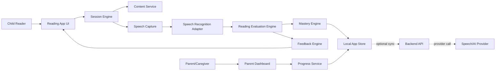

# I Can Read: Architecture

## Document Status
- **Product:** I Can Read phonics practice game
- **Companion document:** `PRD.md`
- **Status:** Draft, living
- **Last updated:** 2026-05-06
- **Purpose:** Describe how the product requirements will be implemented at the system, data, and module level.

## Architecture Goals
- Support short, low-friction read-aloud sessions for a child.
- Keep the child experience fast, warm, and forgiving even when speech recognition is uncertain.
- Separate reading pedagogy rules from UI rendering so content and feedback can improve over time.
- Store only the minimum child data needed for progress tracking.
- Make parent overrides first-class so speech recognition mistakes do not corrupt mastery data.
- Keep the MVP simple enough to ship, while leaving clear paths for cloud sync, adaptive sequencing, and richer content.

## Recommended MVP Shape
Use a web-first application with a local-first data model and a thin server boundary for speech recognition and optional AI feedback.



## Major Components

### Reading App UI
Owns the child-facing experience.

Responsibilities:
- Show warm-up words, story sentences, word spotlight, and victory recap.
- Render phonics words, sight words, segmented views, and sound cues.
- Capture child actions such as start reading, retry, repeat sentence, skip, and finish session.
- Keep visible text large, calm, and uncluttered.
- Avoid showing technical recognition confidence to the child.

Key screens:
- Session start
- Warm-up
- Sentence reader
- Feedback and retry
- Word spotlight
- Victory recap

### Parent Dashboard
Owns caregiver-facing progress and controls.

Responsibilities:
- Show weekly progress summaries.
- Show mastered words and gentle review words.
- Show recent sessions and best moments.
- Allow parent correction overrides.
- Configure session length and difficulty preferences.

The dashboard should read from the same progress records as the child UI, but present them with adult-level detail.

### Session Engine
Coordinates a complete reading session.

Responsibilities:
- Select warm-up words from recent mastery data.
- Select or generate the next micro-story.
- Advance through sentence states: `idle`, `listening`, `evaluating`, `feedback`, `retry`, `spotlight`, `recap`.
- Decide when to end gracefully based on session length, story completion, or parent/child stop action.
- Emit structured events for progress tracking.

Session state should be explicit and serializable so interrupted sessions can recover cleanly.

### Content Service
Provides reading material and metadata.

Responsibilities:
- Store curated micro-stories.
- Tag each story by theme, reading level, phonics patterns, and sight words.
- Provide sentence-level word metadata.
- Support future generated content behind a validation step.

Initial content should be curated manually. Generated stories can come later, but should pass the same validation rules before reaching the child.

### Speech Capture
Handles microphone interaction in the client.

Responsibilities:
- Request microphone permission only when needed.
- Record short utterances per sentence.
- Show clear listening and done states.
- Allow retry if audio is missing or noisy.
- Avoid long-running background recording.

Implementation notes:
- Capture one sentence attempt at a time.
- Keep raw audio only as long as needed for recognition unless parent explicitly opts in to diagnostics.
- Treat capture failures as neutral app errors, not reading mistakes.

### Speech Recognition Adapter
Converts audio into recognized words and confidence metadata.

Responsibilities:
- Hide provider-specific APIs from the rest of the app.
- Return normalized recognition results.
- Include word timing and confidence when available.
- Mark uncertain output clearly.
- Support provider replacement without changing evaluation logic.

Suggested interface:

```ts
type RecognitionResult = {
  transcript: string;
  words: RecognizedWord[];
  provider: string;
  uncertainty: "low" | "medium" | "high";
};

type RecognizedWord = {
  text: string;
  confidence?: number;
  startMs?: number;
  endMs?: number;
};
```

### Reading Evaluation Engine
Compares recognized speech to the target sentence.

Responsibilities:
- Normalize target and recognized words.
- Align spoken words to expected words.
- Identify correct, missed, substituted, inserted, and uncertain words.
- Apply forgiving rules for child speech and recognition ambiguity.
- Produce a structured attempt result for feedback and mastery.

Suggested interface:

```ts
type AttemptEvaluation = {
  sentenceId: string;
  attemptNumber: number;
  status: "passed" | "needs_retry" | "uncertain";
  wordResults: WordAttemptResult[];
  recommendedFocusWord?: string;
};

type WordAttemptResult = {
  targetWord: string;
  spokenWord?: string;
  result: "correct" | "missed" | "substituted" | "inserted" | "uncertain";
  wordType: "phonics" | "sight";
  confidence?: number;
};
```

Evaluation rules:
- Prefer "uncertain" over "wrong" when recognition confidence is low.
- Focus on one teachable word per feedback turn.
- Do not penalize punctuation, capitalization, or harmless repeated words.
- Parent overrides should replace evaluation outcomes for mastery calculations.

### Voice Output Adapter (Teacher Voice)
Owns text-to-speech for spoken prompts and feedback.

Responsibilities:
- Convert short feedback lines into child-friendly speech.
- Keep latency low so feedback feels immediate.
- Expose a single `speak(text, style)` API to UI/session code.
- Allow model swaps without touching pedagogy logic.

MVP recommendation:
- Use **OpenAI `gpt-4o-mini-tts`** as the default voice model.
- Why: lower cost than larger models while producing natural, human-like speech suitable for frequent short prompts.
- Voice style target: warm, encouraging, calm (never robotic or overly synthetic).
- Fallback: if provider call fails, show text feedback and allow replay once service recovers.

Suggested interface:

```ts
type VoiceStyle = "warm" | "neutral" | "celebration";

type VoiceOutputAdapter = {
  speak: (text: string, style?: VoiceStyle) => Promise<void>;
  stop: () => void;
};
```

### Feedback Engine
Turns an evaluation into short, teacher-like feedback.

Responsibilities:
- Praise effort first.
- Name one or more correct words.
- Choose one small correction.
- Use phonics decomposition for decodable words.
- Use snap-word language for sight words.
- Invite retry.
- End with success language.

Feedback can start as deterministic templates. AI-generated feedback can be introduced later, but should be constrained by templates and safety rules.

Suggested interface:

```ts
type FeedbackMessage = {
  praise: string;
  correctCallout?: string;
  teachingPoint?: string;
  retryPrompt?: string;
  closing?: string;
  focusWord?: string;
};
```

### Phonics Engine
Provides decoding metadata for words.

Responsibilities:
- Map words to phonics patterns and grapheme chunks.
- Provide display segmentation such as `sh | i | p`.
- Provide sound cues such as `/sh/ /i/ /p/`.
- Support exceptions and manual overrides.

Initial implementation:
- Use a curated word bank with explicit phonics metadata.
- Avoid guessing complex phonics decomposition until a reliable ruleset exists.

### Sight Word Engine
Handles snap-word behavior.

Responsibilities:
- Identify sight words in sentences.
- Render sight-word visual treatment.
- Track recognition separately from phonics decoding.
- Feed mastered sight words into the rotating sight-word wall.

### Mastery Engine
Updates learning state after each attempt.

Responsibilities:
- Update word-level attempts.
- Track first-try correctness and corrected-after-prompt counts.
- Track last seen date and mastery level.
- Apply parent overrides.
- Recommend review words for future sessions.

Suggested mastery progression:
- `new`: introduced or low attempt count
- `practicing`: seen multiple times but not yet consistently correct
- `strong`: repeated correct readings across sessions

Mastery should use consistency across days, not one perfect attempt.

### Reward Engine
Awards growth-oriented stars and badges.

Responsibilities:
- Award sentence completion stars.
- Award correction-after-coaching stars.
- Award bravery and phonics detective badges.
- Avoid speed-based rewards.
- Store reward events in session records.

### Progress Service
Aggregates data for summaries.

Responsibilities:
- Compute weekly mastered words.
- Identify top confidence words.
- Identify gentle review words.
- Extract "best moment" events such as self-correction.
- Power parent dashboard cards.

## Data Architecture

### Storage Strategy
MVP should be local-first:
- Store child profile, content progress, sessions, and mastery in local app storage.
- Keep data exportable.
- Add backend sync only when multi-device access or backup becomes necessary.

Candidate storage options:
- Browser MVP: IndexedDB through a typed wrapper.
- Native/mobile later: SQLite.
- Cloud later: Postgres behind an authenticated API.

### Core Entities

```ts
type ChildProfile = {
  id: string;
  name: string;
  age: number;
  interests: string[];
  preferredPraiseStyle?: string;
  sessionLengthPreference: 5 | 10 | 15;
  difficultyPreference?: "easy" | "balanced" | "stretch";
  createdAt: string;
  updatedAt: string;
};

type WordRecord = {
  id: string;
  childId: string;
  word: string;
  type: "phonics" | "sight";
  phonicsPattern?: string;
  attempts: number;
  correctFirstTryCount: number;
  correctAfterPromptCount: number;
  lastSeenAt?: string;
  masteryLevel: "new" | "practicing" | "strong";
};

type Story = {
  id: string;
  title: string;
  theme: string;
  level: string;
  sentences: StorySentence[];
};

type StorySentence = {
  id: string;
  text: string;
  words: SentenceWord[];
};

type SentenceWord = {
  text: string;
  type: "phonics" | "sight";
  phonicsPattern?: string;
  segments?: string[];
  sounds?: string[];
};

type SessionRecord = {
  id: string;
  childId: string;
  startedAt: string;
  endedAt?: string;
  totalStars: number;
  badgesAwarded: string[];
  wordsPracticed: string[];
  storiesPracticed: string[];
  parentOverrides: ParentOverride[];
};

type ParentOverride = {
  id: string;
  sessionId: string;
  sentenceId?: string;
  word?: string;
  originalResult: "correct" | "missed" | "substituted" | "inserted" | "uncertain";
  correctedResult: "correct" | "missed" | "substituted" | "inserted" | "uncertain";
  createdAt: string;
};
```

### Event Log
In addition to current state tables, keep a lightweight append-only event log for learning history.

Useful events:
- `session_started`
- `sentence_shown`
- `reading_attempt_recorded`
- `attempt_evaluated`
- `feedback_shown`
- `parent_override_applied`
- `badge_awarded`
- `session_completed`

An event log makes debugging, dashboard summaries, and future algorithm changes easier.

## Primary Data Flows

### Read-Aloud Attempt
1. Session engine selects a sentence.
2. UI renders sentence with word metadata.
3. Child taps or presses to read.
4. Speech capture records one short utterance.
5. Recognition adapter returns normalized words.
6. Evaluation engine aligns recognized words to target words.
7. Feedback engine creates a child-safe message.
8. UI shows feedback and retry controls.
9. Mastery and session records update after final result or override.

### Parent Override
1. Parent opens recent attempt in dashboard.
2. Parent marks a word or sentence as correct, incorrect, or uncertain.
3. Override is stored with timestamp and target attempt.
4. Mastery engine recalculates affected word records.
5. Progress summaries update from corrected data.

### Session Recap
1. Session engine detects completion.
2. Reward engine totals stars and badges.
3. Progress service computes recap details.
4. UI shows words practiced, wins, and one warm closing message.
5. Session record is finalized.

## API Boundaries

The app should keep provider calls behind narrow adapters.

Suggested backend endpoints if a server is introduced:
- `POST /api/speech/recognize`
- `POST /api/feedback/generate`
- `GET /api/content/stories`
- `POST /api/sync/push`
- `GET /api/sync/pull`

For MVP, content and feedback can be local while speech recognition may be remote depending on provider choice.

## Privacy and Safety
- Collect the minimum child data required for progress.
- Do not store raw audio by default.
- Make microphone use explicit and temporary.
- Keep parent controls available for deleting local data.
- Avoid public leaderboards, social sharing, and comparative ranking.
- Treat recognition uncertainty as a system limitation, not a child failure.
- Keep generated content behind validation before it reaches the child.

## Error Handling
- If microphone permission is denied, offer parent help text and a manual practice mode.
- If recognition fails, ask the child to try again with neutral language.
- If confidence is low, mark the attempt uncertain and avoid mastery penalties.
- If storage fails, keep the current session in memory and warn the parent at recap.
- If a provider is unavailable, allow read-with-parent mode without automatic scoring.

## Testing Strategy

### Unit Tests
- Word normalization
- Sentence alignment
- Phonics segmentation lookup
- Sight-word tagging
- Mastery updates
- Reward calculation
- Feedback template selection

### Integration Tests
- Full read-aloud attempt from recognized words to feedback.
- Parent override recalculates mastery.
- Session recap includes expected stars, badges, and practiced words.
- Content metadata renders correct phonics and sight-word treatment.

### Product QA
- Verify feedback stays within tone rules.
- Verify uncertain recognition does not punish the child.
- Verify session can end gracefully at any point.
- Verify parent can understand progress quickly.

## Implementation Phases

### Phase 1: Documentation and Content Foundation
- Finalize PRD and architecture.
- Create curated word bank.
- Create curated story bank with sentence metadata.
- Define phonics and sight-word schemas.

### Phase 2: Local Interactive Prototype
- Build sentence reader UI.
- Build session state machine.
- Implement local content selection.
- Implement deterministic feedback templates.
- Use mocked recognition results for early testing.

### Phase 3: Speech Recognition MVP
- Add microphone capture.
- Add speech recognition adapter.
- Implement word alignment and uncertainty handling.
- Add parent override.

### Phase 4: Progress and Rewards
- Add local persistence.
- Add mastery engine.
- Add stars, badges, recap, and parent dashboard.
- Add weekly progress summaries.

### Phase 5: Hardening and Adaptivity
- Improve phonics sequencing.
- Add better review recommendations.
- Add optional cloud sync.
- Add validated generated content if needed.

## Open Technical Decisions
- Web-only MVP, native app, or cross-platform shell?
- Which speech recognition provider handles child voices best for read-aloud assessment?
- Should feedback be fully deterministic at first, or use constrained AI generation?
- Should raw attempt audio ever be stored with explicit parent consent?
- What phonics curriculum sequence should the content engine follow?
- What local database wrapper should be used once implementation begins?

## Architecture Decision Log
| Date | Decision | Rationale |
| --- | --- | --- |
| 2026-05-06 | Use local-first storage for MVP. | Keeps child data minimal, reduces backend scope, and supports quick iteration. |
| 2026-05-06 | Start with curated content and deterministic feedback templates. | Protects quality and tone while the core reading loop is being proven. |
| 2026-05-06 | Put speech recognition behind an adapter. | Allows provider replacement without rewriting evaluation or UI logic. |
| 2026-05-06 | Use `gpt-4o-mini-tts` for MVP teacher voice output. | Balances low cost and natural-sounding feedback for frequent short prompts. |
| 2026-05-06 | Treat parent overrides as first-class data. | Recognition mistakes should not harm mastery tracking or parent trust. |

## Change Log
| Date | Change | Author |
| --- | --- | --- |
| 2026-05-06 | Created initial architecture document from PRD requirements. | Codex |
| 2026-05-06 | Added MVP teacher-voice adapter and selected `gpt-4o-mini-tts` as default. | Codex |
